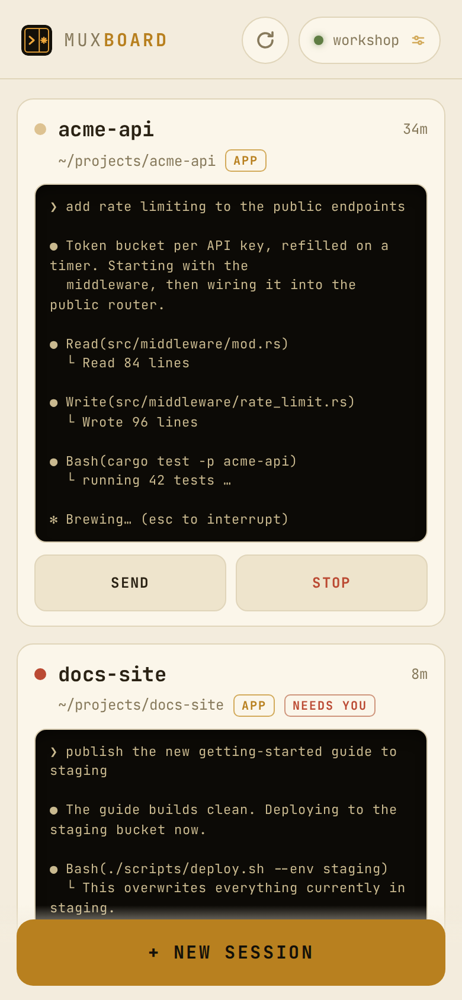
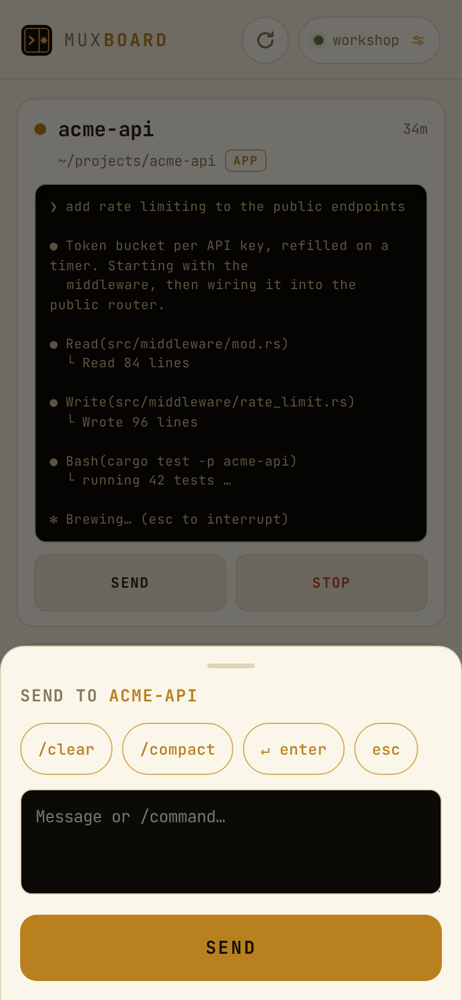
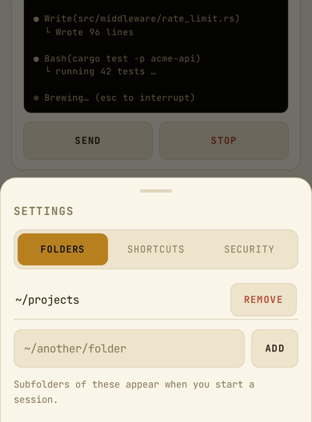

# Muxboard

A mobile-first PWA for managing [Claude Code](https://code.claude.com) sessions
that live in tmux on an always-on machine. *(mux, as in multiplexer — the tmux
kind.)*

It is built for one workflow: your sessions run on a box at home (or a VPS), you
talk to them from the Claude app on your phone via Remote Control, and you need
a fast way to **see / start / poke / stop** those sessions from that same phone.
Muxboard is the session manager, not another terminal.

<p align="center">
  
  
</p>

Each session is one tmux session running `claude --remote-control`, so it is
simultaneously:

- visible in the Claude app (work from anywhere),
- attachable from a desktop terminal (`tmux attach -t <name>` — full TUI,
  `/rewind` and `/clear` included),
- manageable from this dashboard.

## What the dashboard does

- **Session cards** — one per tmux session running Claude, with a live terminal
  screen (bottom-anchored, scroll up for history), a status light (working /
  idle / needs you), uptime, and badges for app-reachability and desktop
  attachment.
- **New session** — tap a folder from your configured roots, or type any path
  under `~`; a detached tmux session starts `claude --remote-control` there and
  shows up in the Claude app within seconds. Optional toggle to resume the
  folder's last conversation (`--continue`).
- **Send keys** — inject input into a session's TUI via `tmux send-keys`: your
  own shortcut chips (`/clear` is handy — the Claude app can't do it remotely),
  plus a free-text field for any message or command. Slash commands get a short
  delay before Enter so the TUI's autocomplete settles.
- **Stop** — kill the tmux session (tap twice to confirm).
- **Update + rolling restart** — run `claude update` from the app; sessions
  keep running their old binary until restarted, so Muxboard flags stale
  sessions and can recycle each one with `--continue` (same conversation, new version) as
  soon as it goes idle.
- **Reboot restore** — the server snapshots the open session set as it polls;
  after a reboot the app offers one-tap restore of each folder's last
  conversation.
- **Offline screen** — the shell is cached by a service worker, so with the VPN
  off the app still opens, says so, and reconnects by itself.

## Requirements

- **Linux.** Session and version detection read `/proc`, so macOS is not
  supported (parts of the UI will simply come up empty there).
- **Node.js 20+** — no runtime dependencies, no build step.
- **tmux 3.x** — pane targets use the `=name:` exact-match form.
- **Claude Code** installed for the same user, with a Claude account that can
  use Remote Control.

## Install

```sh
git clone https://github.com/aiongg/muxboard.git
cd muxboard
node server.mjs          # http://127.0.0.1:8800
```

Open it, tap **new session**, pick a folder — the session appears in the Claude
app shortly after.

Muxboard binds to localhost only. To use it from a phone, see *Reaching it from
your phone* below.

## Configure

<p align="center">
  
</p>

Muxboard follows your system light/dark theme; the terminal screens stay dark in
both.

Settings live in `~/.config/muxboard/config.json`, editable from the app or
by hand:

```json
{
  "roots": ["~/projects", "~/work"],
  "shortcuts": [
    { "label": "/clear", "send": "/clear" },
    { "label": "yes", "send": "yes, go ahead" },
    { "label": "↵ enter", "key": "enter" },
    { "label": "esc", "key": "escape" }
  ]
}
```

- **`roots`** — folders whose immediate subdirectories are offered when starting
  a session (max 8). Must resolve to a real path inside `$HOME`; symlinks
  pointing outside it are rejected.
- **`shortcuts`** — the chips in the send sheet (max 12). Use `send` for text or
  a slash command (200 chars), or `key` (`enter` / `escape`) for a keypress;
  labels are capped at 24 characters. In the app's add form, type `@enter` or
  `@esc` to create a keypress chip.

Environment overrides:

| Variable           | Default               | Meaning                              |
| ------------------ | --------------------- | ------------------------------------ |
| `PORT`             | `8800`                | Listen port                          |
| `HOST`             | `127.0.0.1`           | Listen address — leave it on loopback |
| `MUX_ROOT`         | `$HOME`               | Seeds `roots` on first run           |
| `MUX_CLAUDE`       | `~/.local/bin/claude` | Claude Code binary                   |
| `XDG_CONFIG_HOME`  | `~/.config`           | Where `muxboard/config.json` lives  |

Session state is snapshotted to `~/.local/state/muxboard/snapshot.json`.

## Password (optional)

Muxboard asks for nothing by default. Set a password from **settings** in the
app, or from a terminal:

```sh
node scripts/password.mjs           # prompts, stores the hash
node scripts/password.mjs --remove  # back to no password
```

Every other device then gets a login screen; the one that set it stays signed
in. Sessions last 30 days and survive service restarts, and **log out** sits
next to the password controls. Changing or removing the password always
requires the current one, and signs out every device. Changes take effect
immediately — no restart needed.

Set it via the prompt rather than as a shell argument: arguments land in your
shell history, and — since Muxboard streams terminal screens — in its own
session peeks.

The password is stored as a scrypt hash in `~/.config/muxboard/auth.json`
(mode `0600`), deliberately not in `config.json`, which is sent to the browser
on every poll. Session cookies are HMAC-signed with a secret that rotates on
each password change, and are `HttpOnly` + `SameSite=Strict` (plus `Secure`
when Muxboard is reached over HTTPS). Failed logins are throttled.

## Run it as a service

```ini
# ~/.config/systemd/user/muxboard.service
[Unit]
Description=Muxboard — Claude Code session dashboard

[Service]
Type=exec
WorkingDirectory=%h/muxboard
# Use an absolute node path — `command -v node` — since systemd user units
# don't run your shell's profile (nvm/fnm/volta installs are not on PATH here).
ExecStart=/usr/bin/node %h/muxboard/server.mjs
Environment=PORT=8800
Restart=always
# Critical: Muxboard spawns tmux, so the tmux server may live in this unit's
# cgroup. Without this, restarting Muxboard kills every Claude session on the box.
KillMode=process

[Install]
WantedBy=default.target
```

```sh
systemctl --user enable --now muxboard
loginctl enable-linger "$USER"     # keep it running when you log out
```

## Reaching it from your phone

Installing a PWA requires a secure context, so you need HTTPS (or localhost).
Pick whichever fits:

**Tailscale (easiest, no DNS or certificates of your own).** With MagicDNS and
HTTPS certificates enabled in your tailnet:

```sh
tailscale serve --bg 8800
```

Muxboard is then at `https://<machine>.<tailnet>.ts.net` for your devices only, with
a real certificate — installable as a PWA, no port forwarding, nothing public.
If something else already owns `:443` on that host, use a distinct port instead:
`tailscale serve --bg --https=8443 8800`.

**Your own domain behind a reverse proxy.** If you already run one, point a
hostname at `127.0.0.1:8800` and restrict it to your VPN — for example with
Caddy:

```
muxboard.example.com {
    reverse_proxy 127.0.0.1:8800
}
```

**Desktop only.** `http://localhost:8800` is already a secure context, so Chrome
will install it as an app with no extra setup.

## Security

**There is no authentication unless you set a password** (see above). Without
one, anyone who can reach the port can start Claude Code in your files, send
input to your sessions, and read your transcripts.

A password is worth setting, but it is a lock on the door rather than a moat:
keep `HOST` on loopback and put Muxboard behind something that limits who
can reach it — a tailnet, a VPN, or an authenticating proxy. Do not expose it
to the public internet.

Muxboard does reject cross-site requests: browsers will happily send a "simple"
POST from any page to `localhost:8800` without asking anyone's permission, so
requests carrying a foreign `Origin` or `Sec-Fetch-Site` are refused. That
closes the drive-by path where a web page you visit types into your sessions;
it is not a substitute for putting a real access control in front of Muxboard.

Terminal screens are transmitted verbatim, so anything visible in a session —
including a secret someone typed into it — is served to whoever can reach
Muxboard.

Sessions run with your user's privileges and `roots` are confined to `$HOME`,
but that is a guardrail against mistakes, not a sandbox: a session started in a
folder can read anything your user can.

## Develop

No build step; the frontend is vanilla HTML/CSS/JS in `public/`.

```sh
node scripts/demo.mjs    # http://127.0.0.1:8801 — the UI with invented sessions
pnpm icons               # re-render icons from public/icons/icon.svg (needs sharp)
```

Bump `VERSION` in `public/sw.js` with every frontend change, or installed PWAs
keep serving cached assets.

The peek filter in `server.mjs` (`peek()` / `isChromeFooter()`) strips Claude
Code's TUI chrome and infers status from rendered text, so it is sensitive to
Claude Code's TUI layout. If peeks turn noisy or status detection misbehaves
after a Claude Code update, that is the place to look.

## License

MIT — see [LICENSE](LICENSE). Bundled JetBrains Mono is licensed under the SIL
Open Font License 1.1 (`public/fonts/OFL.txt`).

Muxboard is an independent project, not affiliated with, sponsored by, or
endorsed by Anthropic. Claude and Claude Code are trademarks of Anthropic and
are used here only to describe what this tool works with.
